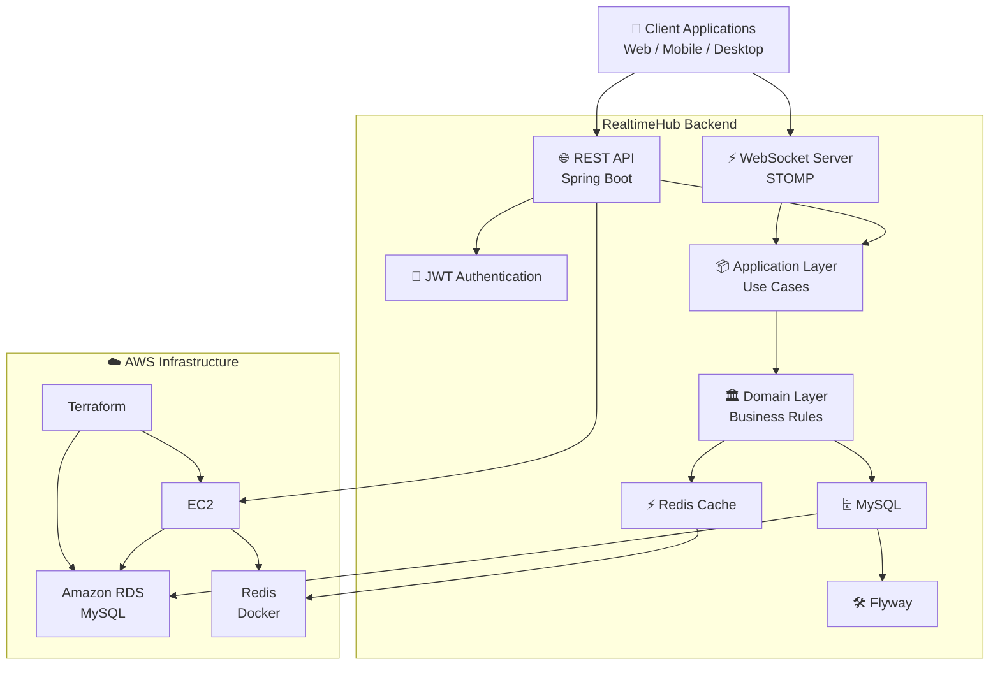

# 🚀 RealtimeHub

> A modern real-time communication platform built with **Kotlin** and **Spring Boot**, following **Domain-Driven Design (DDD)** and **Clean Architecture**, designed for scalable cloud-native applications.


---

# 📖 Overview

RealtimeHub is a backend platform for building **real-time applications** with high scalability and maintainability.

It provides a solid foundation for applications that require instant communication, such as:

* 💬 Real-time chat
* 🔔 Push notifications
* 👥 User presence management
* 📡 WebSocket communication
* 🌐 REST APIs
* ☁️ Cloud-native deployment

The project follows modern software engineering practices, emphasizing:

* Domain-Driven Design (DDD)
* Clean Architecture
* SOLID Principles
* Low coupling
* High cohesion
* Infrastructure as Code (Terraform)

---

# ✨ Features

* REST API
* WebSocket communication
* JWT Authentication
* MySQL persistence
* Redis caching
* Flyway database migrations
* Bean Validation
* Spring Boot Actuator
* OpenAPI / Swagger documentation
* Docker support
* Terraform infrastructure
* AWS-ready deployment

---

# 🏗 Architecture

The project follows a **Clean Architecture** approach.

```text
src
└── main
    ├── application
    ├── domain
    ├── infrastructure
    ├── interfaces
    ├── persistence
    ├── shared
    └── config
```

## Layers

### Domain

Contains only business rules.

* Entities
* Value Objects
* Domain Services
* Repository Interfaces
* Domain Events
* Business Exceptions

---

### Application

Implements application use cases.

* Commands
* Queries
* DTOs
* Application Services

---

### Infrastructure

Technical implementations.

* External integrations
* Repository implementations
* Cloud services
* Messaging
* Configuration

---

### Interfaces

Application entry points.

* REST Controllers
* WebSocket Controllers
* Exception Handlers

---

### Persistence

Responsible for data access.

* JPA Entities
* Spring Data Repositories
* Mappers
* Database Converters

---

# 🛠 Tech Stack

## Language

* Kotlin

## Framework

* Spring Boot

## Backend

* Spring Security
* Spring Data JPA
* Spring WebSocket
* Spring Validation
* Spring Actuator

## Database

* MySQL
* Flyway

## Cache

* Redis

## Infrastructure

* Docker
* Terraform
* AWS

## Build Tool

* Gradle (Kotlin DSL)

## Testing

* JUnit 5
* MockK
* Testcontainers

---

# 📂 Project Structure

```text
.
├── src/
├── terraform/
├── docker/
├── gradle/
├── build.gradle.kts
├── settings.gradle.kts
└── README.md
```

---

# 🚀 Getting Started

## Prerequisites

* Java 21
* Gradle
* Docker
* Docker Compose
* MySQL
* Redis

---

## Clone the Repository

```bash
git clone https://github.com/Joao-ale/app-realtimehub.git

cd app-realtimehub
```

---

## Configure the Application

Update your `application.yml` with:

* MySQL connection
* Redis configuration
* JWT secret
* Application properties

---

## Run the Application

```bash
./gradlew bootRun
```

or

```bash
./gradlew clean build
```

---

# 🐳 Running with Docker

Start the local infrastructure:

```bash
docker compose up -d
```

---

# ☁️ Infrastructure

Infrastructure is managed using **Terraform**.

Resources include:

* VPC
* EC2
* RDS MySQL
* Security Groups
* IAM
* CloudWatch

Deploy infrastructure:

```bash
cd terraform

terraform init
terraform plan
terraform apply
```

---

# 🔐 Security

* JWT Authentication
* Spring Security
* BCrypt password hashing
* Request validation
* CORS configuration

---

# 📊 Monitoring

Spring Boot Actuator endpoints:

```text
/actuator
```

```text
/actuator/health
```

```text
/actuator/metrics
```

---

# 📚 API Documentation

After starting the application:

```text
http://localhost:8080/swagger-ui/index.html
```

---

# 🧪 Running Tests

Execute all tests:

```bash
./gradlew test
```

Generate the JaCoCo coverage report:

```bash
./gradlew jacocoTestReport
```

---

# 🗺 Roadmap

* [x] Clean Architecture
* [x] Domain-Driven Design
* [x] REST API
* [x] WebSocket support
* [x] JWT Authentication
* [x] MySQL integration
* [x] Redis integration
* [x] Flyway migrations
* [x] Docker support
* [x] Terraform infrastructure
* [ ] Kafka messaging
* [ ] Kubernetes deployment
* [ ] CI/CD pipeline
* [ ] AWS ECS deployment
* [ ] Prometheus & Grafana monitoring
* [ ] OpenTelemetry distributed tracing

---

# 🤝 Contributing

Contributions are welcome!

1. Fork the repository.
2. Create a feature branch.
3. Commit your changes.
4. Push your branch.
5. Open a Pull Request.

---

# 📄 License

This project is licensed under the **MIT License**.

---

# 👨‍💻 Author

**João Alexandre Silva de Santana**

* GitHub: https://github.com/Joao-ale
* LinkedIn: https://www.linkedin.com/in/joão-alexandre-silva-de-santana

---

## ⭐ Support

If you found this project useful, consider giving it a **star** on GitHub. It helps increase the project's visibility and supports its continued development.


